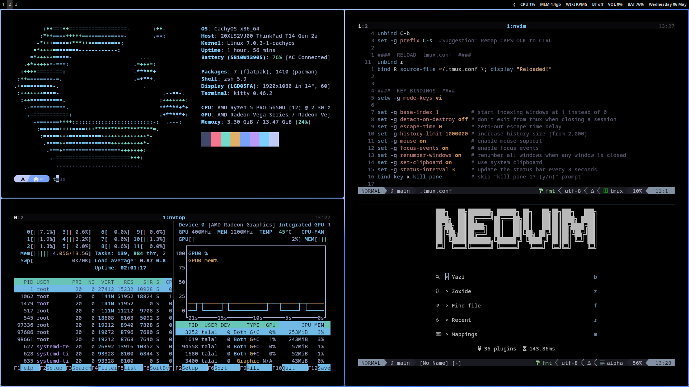

# dotfiles

minimal hyprland setup — managed with [gnu stow](https://www.gnu.org/software/stow/)



---

## components

| tool                                                    | role                |
| ------------------------------------------------------- | ------------------- |
| [hyprland](https://hyprland.org)                        | wayland compositor  |
| [waybar](https://github.com/Alexays/Waybar)             | status bar          |
| [kitty](https://sw.kovidgoyal.net/kitty/)               | terminal            |
| [nvim](https://neovim.io)                               | editor              |
| [yazi](https://github.com/sxyazi/yazi)                  | file manager        |
| [fuzzel](https://codeberg.org/dnkl/fuzzel)              | app launcher        |
| [cava](https://github.com/karlstav/cava)                | audio visualizer    |
| [fastfetch](https://github.com/fastfetch-cli/fastfetch) | system stats        |
| [mako](https://github.com/emersion/mako)                | notification daemon |
| [mpv](https://mpv.io/)                                  | media viewer        |
| [zed](https://zed.dev/)                                 | IDE                 |
| zsh + tmux                                              | shell & multiplexer |

---

## install

```bash
git clone https://github.com/Talalahmed409/dotfiles.git ~/dotfiles
cd ~/dotfiles
stow --target=$HOME .
```

> make sure [gnu stow](https://www.gnu.org/software/stow/) is installed: `sudo pacman -S stow`
